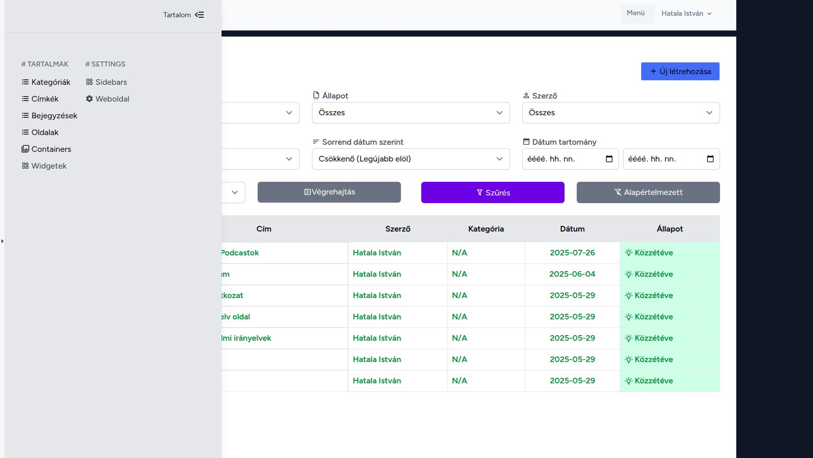
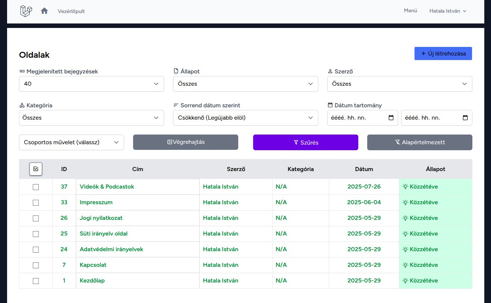
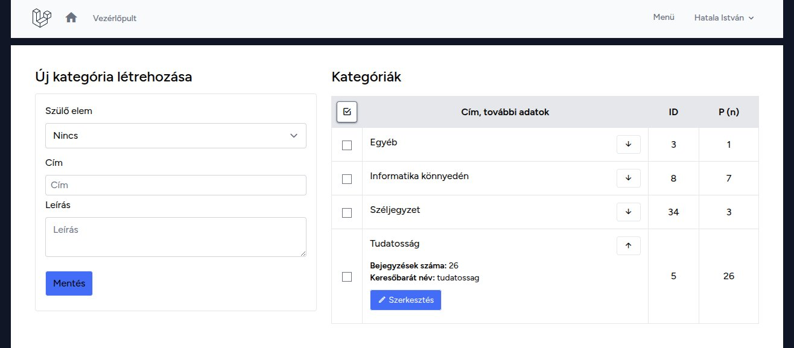
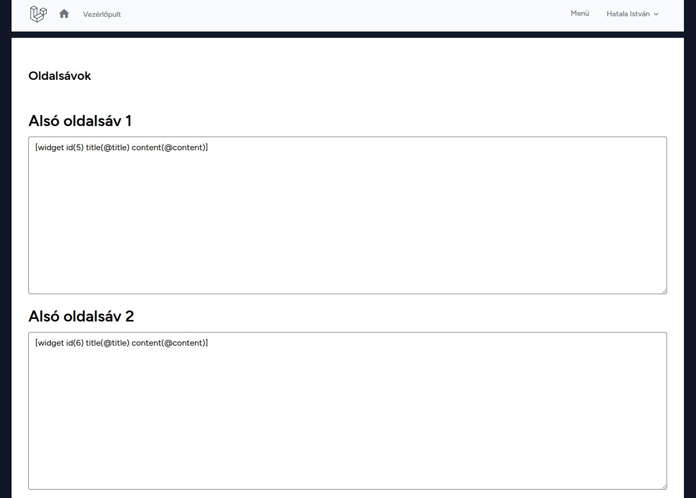
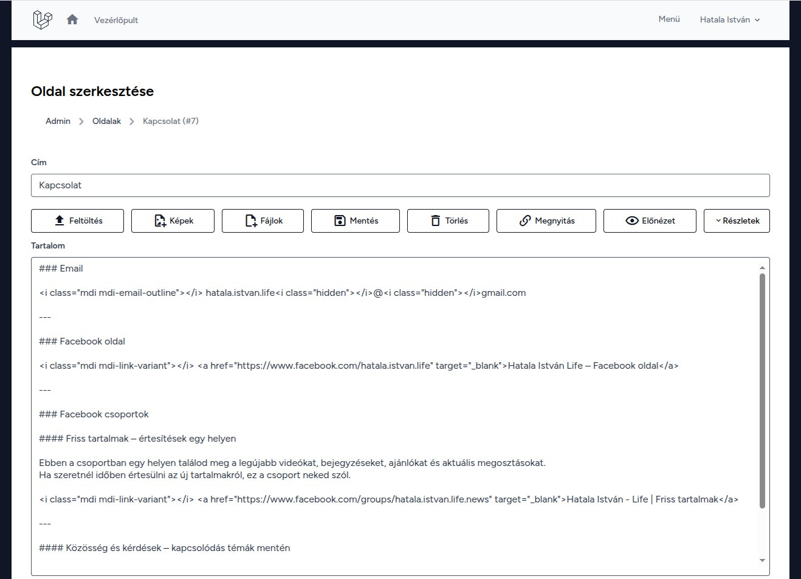
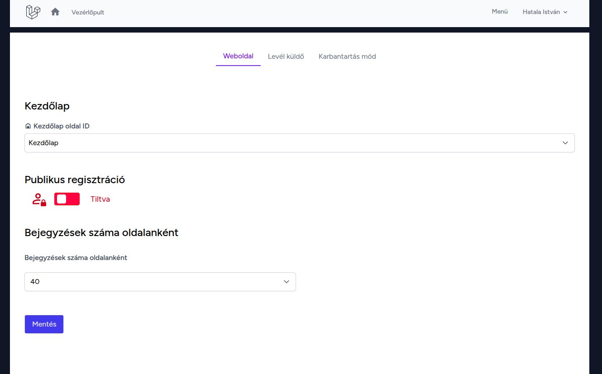

# Focus CMS – Demo

This short demo presents some of the main administrative features of Focus CMS through screenshots.

---

Language: English | [Magyar](Demo.hu.md)

---

## Admin interface – menu

Short description: the top administrative menu, where the main administration actions are accessible.

---

## Pages list

The interface used for managing pages within the system.

---

## Categories

Hierarchical category management with a clear and easy-to-navigate structure.

---

## Theme and widget examples

An example of how the theme and widget system appears, and how widgets can be inserted using shortcodes.

---

## Editor view example

Markdown-based content editing, along with related configuration options.

---

## Settings

System- or user-specific settings interface.
These are examples only; the actual interface may vary depending on the active theme and configuration.
